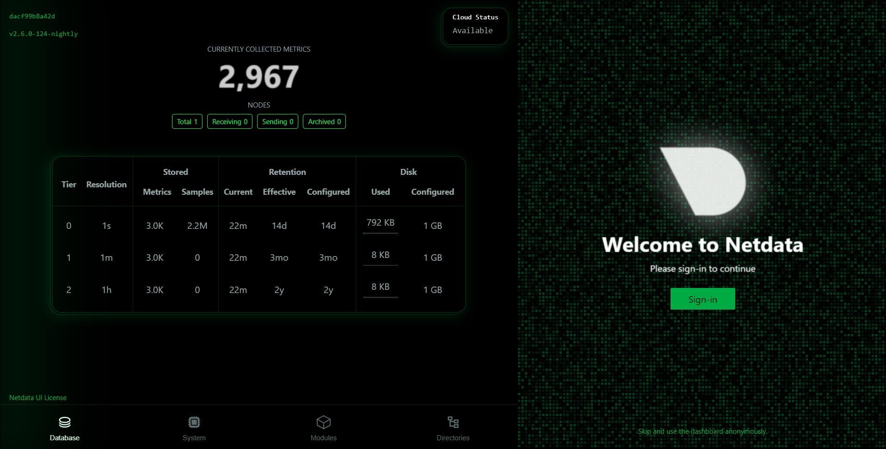

# Task 7: Monitor System Resources Using Netdata

## Objective
Install **Netdata** and visualize system and application performance metrics.

## Tools
- Netdata (free, open-source monitoring tool)
- Docker

## Deliverables
- Screenshot of the dashboard and running metrics

---

## Mini-Guide (Hints)

### 1. Run via Docker
```bash
docker run -d --name=netdata -p 19999:19999 netdata/netdata
```

### 2. Access the Dashboard
Open your browser and go to:
```
http://<EC2-PUBLIC-IP>:19999
```

### 3. Monitor Metrics
- CPU usage
- Memory usage
- Disk activity
- Docker containers performance

### 4. Explore Features
- Alerts and chart panels
- Logs in `/var/log/netdata`

---

## Steps for AWS EC2 Deployment

### Launch AWS EC2 Instance
- **AMI**: Ubuntu 22.04 LTS
- **Instance Type**: t2.micro or higher
- **Security Group Rules**:
  - Allow **SSH** (TCP 22) from your IP
  - Allow **Netdata** (TCP 19999) from your IP

### Connect to Instance
```bash
ssh -i /path/to/key.pem ubuntu@<EC2-PUBLIC-IP>
```

### Install Docker
```bash
sudo apt-get update -y
sudo apt-get install -y docker.io
sudo systemctl enable --now docker
```

### Run Netdata
```bash
sudo docker run -d --name=netdata -p 19999:19999 netdata/netdata
```

---

## Exploring Logs
```bash
sudo docker exec -it netdata ls /var/log/netdata
sudo docker exec -it netdata tail -n 20 /var/log/netdata/error.log
```

---

## Proof of Work

### Running Container


### Netdata Dashboard


### Running Metrics

